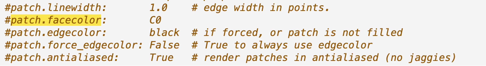
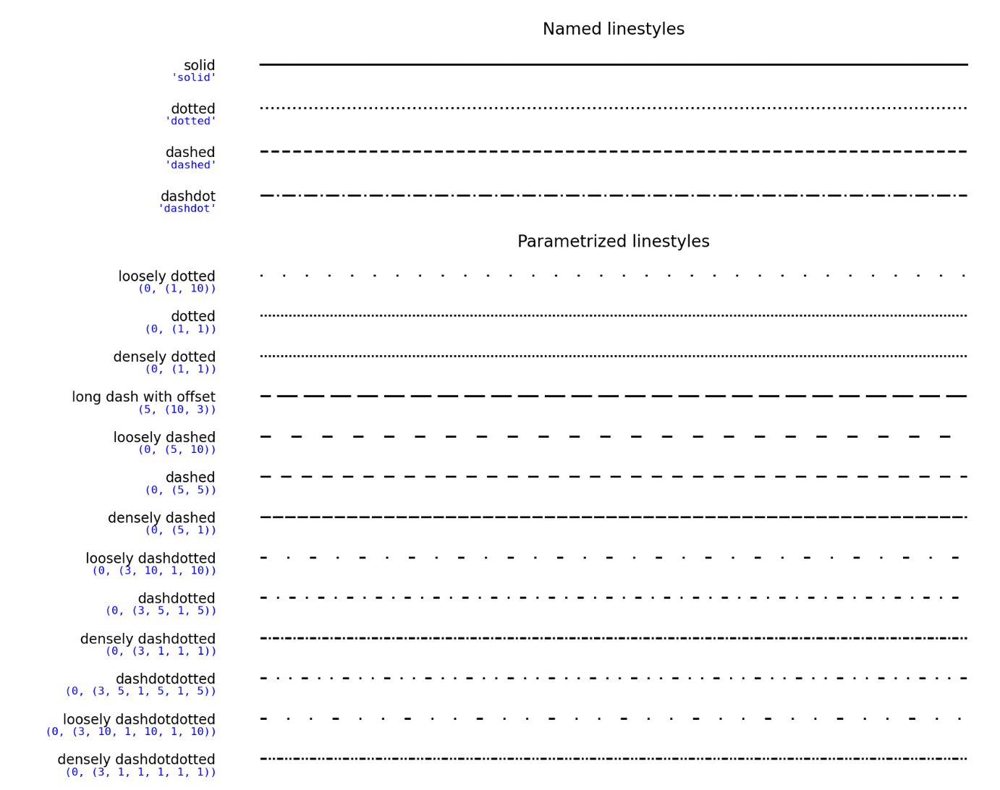

# Matplotlib.Collections.Collection

## 基本介绍
Collection 是 Matplotlib 中表示图形元素集合的基类。它是其他集合类（如 PathCollection、LineCollection、PolyCollection 等）的父类，并提供了一些共用的方法和属性。通常情况下，你不会直接使用 Collection 类，而是使用其子类来创建特定类型的集合。

### 基本类
matplotlib.collections.·(*, edgecolors=None, facecolors=None, linewidths=None, linestyles='solid', capstyle=None, joinstyle=None, antialiaseds=None, offsets=None, offset_transform=None, norm=None, cmap=None, pickradius=5.0, hatch=None, urls=None, zorder=1, **kwargs) 
### 方法
* set_transform()：设置集合的坐标变换对象。
* set_offset_position()：设置集合的偏移位置。
* get_offset_position()：获取集合的偏移位置。
* set_offset_position_fraction()：设置集合的偏移位置为子图的百分比。
* get_paths()：获取集合中的路径列表。
* set_paths()：设置集合中的路径列表。
* set_facecolors()：设置集合元素的填充颜色。
* set_edgecolors()：设置集合元素的边缘颜色。
* set_linewidths()：设置集合元素的线宽。
* set_linestyles()：设置集合元素的线型。
* set_segments()：设置集合元素的线段。

### 参数设置
* Edgecolors：可以是color也可以是list of color
default: rcParams["patch.edgecolor"] (default: 'black') 
https://matplotlib.org/stable/api/artist_api.html#module-matplotlib.patches
* facecolors：default: rcParams["patch.facecolor"] (default: “C0”)

* linewidths: default: rcParams["patch.linewidth"] (default: 1.0)
* linestyles: str or tuple or list thereof,有效格式包括['solid', 'dashed', 'dashdot', 'dotted', '-', '--', '-.', ':'].

* Capstyle：线条样式，'butt', 'projecting', 'round'
* Joinstyle：用于连接集合中所有路径的线的样式。 'miter', 'round', 'bevel'，
* Antialiaseds：线条是否抗锯齿，布尔，默认True
* cmap, norm：颜色空间映射和正则化
* hatch：路径可以填充的形状，有['/', '', '|', '-', '+', 'x', 'o', 'O', '.', '*'].
* Pickradius：当 pickradius <= 0，每当测试点位于由 Collection 中 Path 的控制点形成的多边形之一内部时，Collection.contains会返回True；当pickradius>0时候，会判断测试点是否包含在对应path周围左5，右5的范围内。
* Urls：hatch的链接，比如svg
* Zorder：绘图顺序，float, default: 1

### LineCollection
LineCollection 是一种用于绘制线段集合的集合类型，它允许您以一次性绘制多条线段，并可以为每条线段设置不同的属性，如线型、颜色等.

_class matplotlib.collections.LineCollection(segments, *, zorder=2, **kwargs) 
* segments：元素为线的list，（line1,line2,line3…）,其中每条线是有m个点组成的line_n = (x0, y0), (x1, y1), ... (xm, ym)
* colors：default：“C0”，colors或者list of colors
* antialiaseds：default：True，表示是否打开线的抗锯齿
* facecolors：设置面颜色时，每条线都被解释为一个区域的边界，隐式关闭从最后一个点到第一个点的路径。对于面的“内部”可以通过PathCollection的 CLOSEPOLY 来指定。
后面的参数可以继承base类，Collection

### PolyCollections
PolyCollections 用来管理并绘制多边形的集合。
* verts（list of array-like）比如polygons1:[vert1,vert2,...]

PolyCollection可通过指定定点来自定义多边形，也可以修改不同的颜色，以至于PolyCollection可以用来绘制热力图（与颜色相关）以及地图（与顶点相关）
### RegularPolyCollection
RegularPolyCollection 绘制规则多边形元素，例如正多边形（正方形、正六边形等）。
* numsides（int）多边形的边数。
* rotation 旋转角度
* size (int,)多边形外接圆的面积（以点^2为单位）
但是注意，往往RegularPolyCollection 主要用于点云数据的可视化，而不是为了绘制完整的多边形。如果要绘制规则多边形，通常会使用Polygon对象。

### PathCollections
PathCollections 是一种用于绘制散点图的集合类型，允许一次性绘制多个点，并为每个点设置不同的属性（比如颜色，大小）

### CricleCollections
CircleCollcetions 是用于绘制多个圆形或者椭圆形的图形元素。可允许一次性绘制多个圆形或者椭圆形，并为每个圆形设置不同的属性，比如位置、半径、颜色和边界样式。

### PatchCollections
PatchCollections 适用于管理和绘制多个图形补丁（Patch）的集合。图形补丁可以是各种形状包括矩阵、多边形、圆形和椭圆形等。
* match_original：如果为 True，则使用原始色块的颜色和线宽。如果为 False，则可以通过提供标准集合参数、facecolor、edgecolor、linewidths、norm 或 cmap 来分配新颜色。

### StarPolygonCollection

### QuadMesh

### TriMesh
