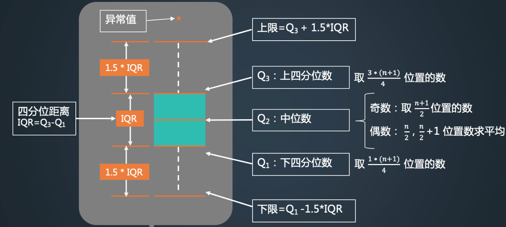

# 箱型图的定义
箱形图（英文：Box plot）：又称为盒须图、盒式图、盒状图或箱线图，是一种用作显示一组数据分散情况资料的统计图。因型状如箱子而得名。

# 箱型图的优点
箱形图最大的优点就是不受异常值的影响，可以以一种相对稳定的方式描述数据的离散分布情况。

# 绘制箱型图利用五数概括法
五数概括法：即用下面的五个数来概括数据（最小值；第1四分位数(Q1)；中位数(Q2)；第3四分位数(Q3)；最大值），箱形图与之类似。



# 五数概括法计算举例
例如：数据 A = [0,0,1,1,2,2]

首先计算中位数，Q2，由于列表A为偶数，含6个数据，因此排序后取第3，第4位数取平均，即（1+1）/2 = 1。

因此中位数Q2 = 1；

下四分数计算方法，Q1，首先序列长度为6，取（1*（n+1））/4 = (1*7)/4 = 1.75，说明这个数在1.75个位置处，但实际上这个数是不存在的，这个数位于第1个数和第2个数之间，假设这两个数之间均匀分布，那意味着第1个数乘以0.75，第2个乘以(1-0.75)=0.25，因此结果为0\*0.75 + 1\*0.25 = 0.25；

因此下四分数Q1 = 0.25；

上四分数，Q3，同理Q1，取（3\*（n+1））\4 = 3*7\4 = 21\4 = 5.25; 即第5个数和第6个数之间，即2\*0.25 + 2\*0.75 = 2；

四分位距 IQR = Q3-Q1 = 2 - 0.25 = 1.75

上限 =（Q3+1.5IQR，max）取最小 = min(2+1.5*1.75,2) = 2

下限 =（Q1-1.5IQR ，min)取最大 = max(0.25-1.5*1.75, 0) = 0。


# 箱型图判别异常值

箱线图判断异常值的标准以四分位数和四分位距为基础，四分位数具有一定的耐抗性，多达25%的数据可以变得任意远而不会很大地扰动四分位数，所以异常值不会影响箱形图的数据形状，箱线图识别异常值的结果比较客观。由此可见，箱线图在识别异常值方面有一定的优越性。

# 案例

```python
import numpy as np
import pandas as pd
import matplotlib.pyplot as plt
 
data = {
    'A': [1000, 1200, 1300, 1400, 1500, 1600, 1700, 1800, 1900, 2500],
    'B': [1200, 1300, 1400, 1500, 1600, 1700, 1800, 1900, 2000, 2100],
    'C': [1000, 1200, 1300, 1400, 1500, 1600, 1700, 1800, 1900, 2000],
    "D": [800, 1000, 1200, 1300, 1400, 1500, 1600, 1700, 1800, 1900]
}
 
df = pd.DataFrame(data)
print(df.describe())
df.plot.box(title="box plot")
plt.grid(linestyle="--", alpha=0.3)
plt.show()
```