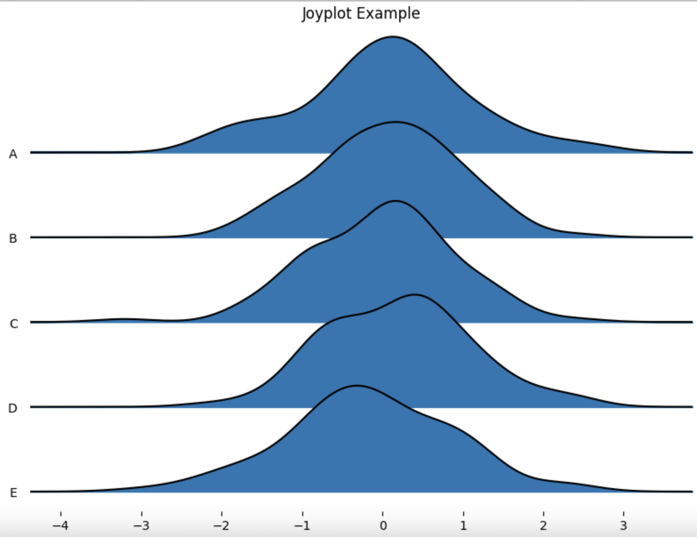
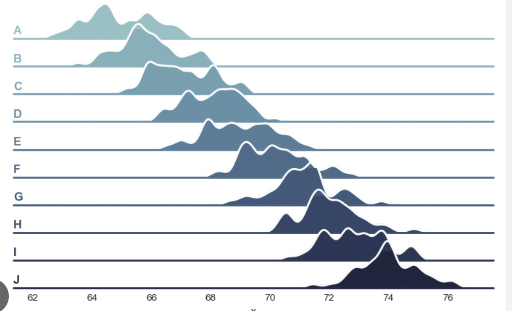

# Joy Plot 重叠山峦图
- 用处:可视化分组数据数据分布
- 需要安装joypy库

## 参数
- data:数据集
- column:使用data的中的有限列进行绘图
- by=None:按照数据集中所选列进行分组
- gird=false:添加网格线
- xlabelsize=none:x轴标签的大小，可以设置 xlabelsize='medium' 或 xlabelsize=12（表示 12pt 大小）来指定 y 轴标签的大小。如果想使用默认大小，则设置 xlabelsize=None
- ylabelsize=none:y轴标签的大小
- xrot=none:x轴刻度线标签旋转角度
- yrot=none:y轴刻度线标签旋转角度
- hist=flase:显示直方图（这个参数可以切换分组直方图与分组山峦图）
- fade=flase:如果设定的是true，则显示渐变色
- ylim=max:指定了图中共享的 y 轴的最大值。如果设置为 max，则表示所有子图共享 y 轴刻度，其中 y 轴的最大值将是所有子图中最大的密度值。这有助于比较不同组的分布。你也可以设置为其他值，如具体的数值，以确保不同子图之间的 y 轴刻度一致
- fill=true:设置是否填充曲线下的颜色
- linecolor=None:曲线的颜色，可选字符串（表示颜色的名称或十六进制颜色代码，例如 'red', 'blue', '#FFA500' 等）
、RGB 元组（表示颜色的 RGB 值，范围在 0 到 1 之间，例如 (1, 0, 0) 表示红色）或None（表示使用默认颜色）
- blackground=none:背景颜色，可选字符串（表示颜色的名称或十六进制颜色代码，例如 'white', 'lightgray', '#F0F0F0' 等）、RGB 元组（表示颜色的 RGB 值，范围在 0 到 1 之间，例如 (1, 1, 1) 表示白色）或None（表示使用默认背景颜色）
- overlap=1:控制重叠程度
- title=none:添加图表的标题
- colormap=none:设置填充颜色
## 示例（图片来源Google）

