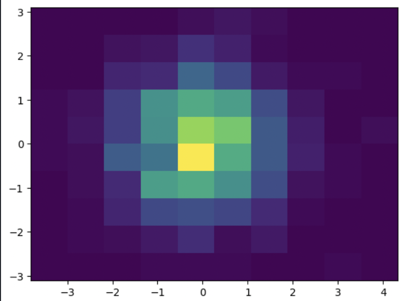
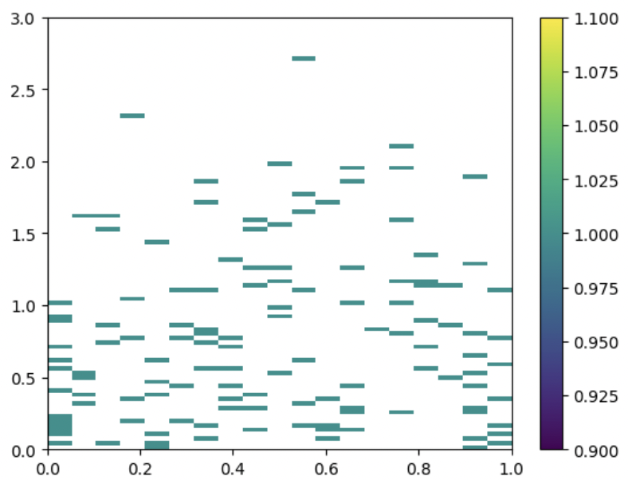

# 2D 直方图
2D直方图通常用于展示数据的分布情况。

来源：https://matplotlib.org/stable/api/_as_gen/matplotlib.pyplot.hist2d.html

代码参考：https://blog.csdn.net/qq_40206371/article/details/132200985?ops_request_misc=%257B%2522request%255Fid%2522%253A%2522170202093716800226515486%2522%252C%2522scm%2522%253A%252220140713.130102334..%2522%257D&request_id=170202093716800226515486&biz_id=0&utm_medium=distribute.pc_search_result.none-task-blog-2~all~sobaiduend~default-2-132200985-null-null.142^v96^pc_search_result_base9&utm_term=matplotliby%20%E4%BA%8C%E7%BB%B4%E7%9B%B4%E6%96%B9%E5%9B%BE&spm=1018.2226.3001.4187

## 函数简介
matplotlib.pyplot.hist2d(x, y, bins=10, range=None, density=False, weights=None, cmin=None, cmax=None, *, data=None, **kwargs)

### 参数描述

**x,y**:输入，数组，形状(n,)

**bins**:区间的数值，默认数值为10*10；取值可选None、int、[int,int]、数组、[array,array]
；(值为int，代表nx=ny=bins;值为[int,int]，代表nx,ny= bins;值为数组，代表x_edges = y_edges = bins;值为[array,array],代表x_edges,y_edges = bins，具体看示例)

**range**:可选参数，数组，形状(2,2);代表x跟y的bin的最左边缘和最右边缘,[[xmin,xmax],[ymin,ymax]]在此范围之外的所有值都将被视为异常值，并且不会在直方图中进行统计.

**density**:布尔数,默认:False
标准化直方图。

**weights**：数组，形状(n,),可选参数，为每个样本赋予权重

**cmin,cimx**:所有计数小于cmin或大于cmax的bin将不会显示

### 示例

