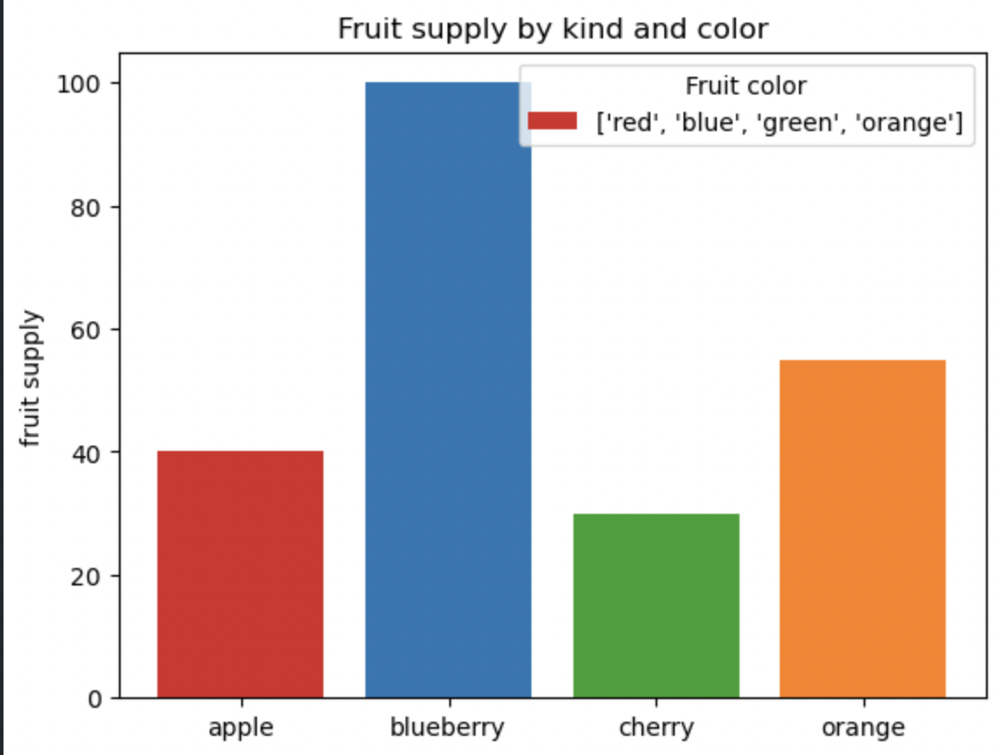
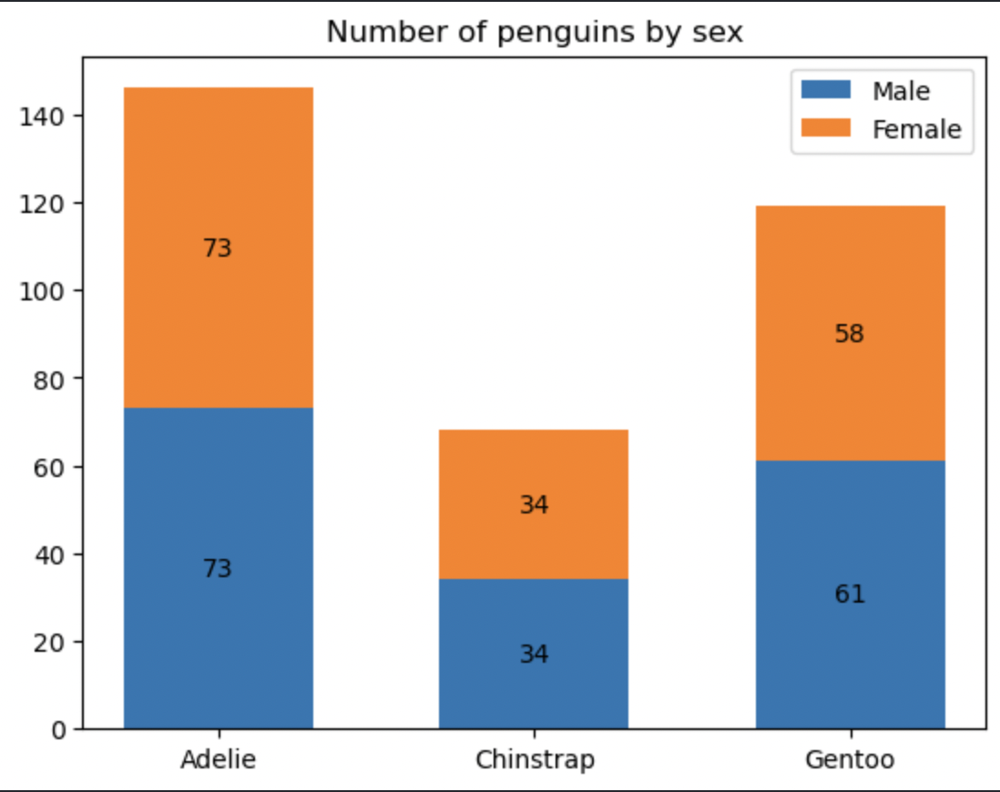
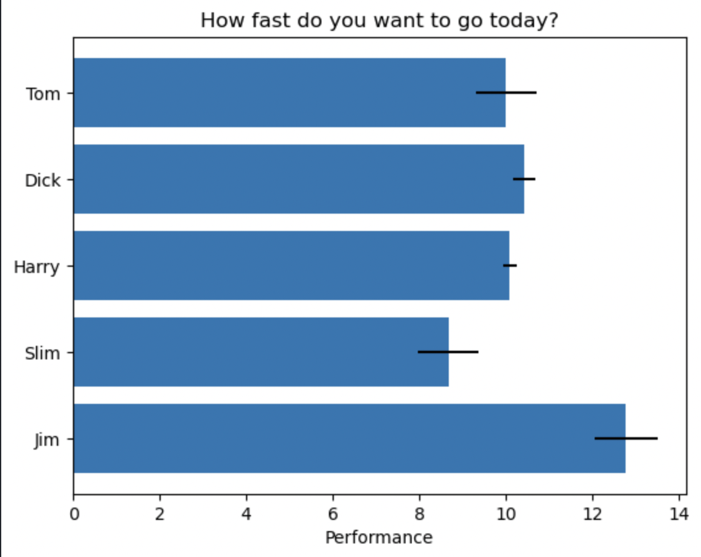
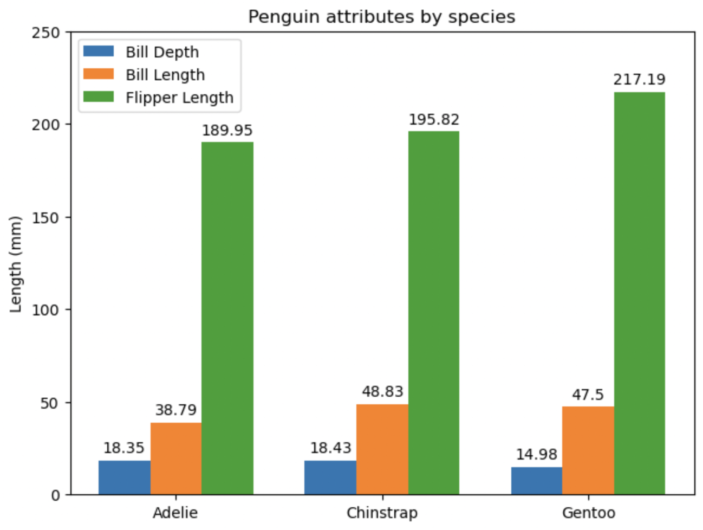

# 条形图
## 基础条形图
Axes.bar(x, height, width=0.8, bottom=None, *, align='center', data=None, **kwargs)

**x**:浮点数或数组,条形的x坐标

**height**:浮点数或数组，条形图高度。如果bottom有单位（例如日期时间），则height的单位应与bottom值不同（例如height可以是timedelta）

**width**:默认值：0.8,浮点数或数组。如果x有单位（例如日期时间），则宽度的单位应为x值周围的差异（例如 timedelta）

**bottom**:默认值：0,浮点数或数组。条形底边的 y 坐标

**align**:对齐。可选{'center', 'edge'}，默认：'center'

**color**:颜色或者颜色列表，条形颜色，可选参数

**edgecolor**:颜色或者颜色列表，条形边缘颜色，可选参数

**linewidth**:浮点数或数组。可选参数。条形边缘的宽度。如果为 0，则不绘制边缘

**tick_label**:字符串或字符串列表。可选参数。条形的刻度标签。默认值：None（表示使用默认数字标签）

**label**:字符串或字符串列表。可选参数。如果提供了列表，则它的长度必须与x相同并标记各个条。

**xerr, yerr**:float 或类似数组的形状(N,) 或形状(2, N)，可选参数。水平/垂直误差条
- 标量：所有柱的对称 +/- 值
- shape(N,)：每个条形的对称 +/- 值
- shape(2, N)：每个bar的单独 - 和 + 值。第一行包含较低的错误，第二行包含较高的错误。
- 无：无误差条。（默认）

**ecolor**:颜色或颜色列表，默认值：'black'.误差条的线条颜色。

**log**:布尔数,默认：False。选择True 会将 y轴设置为对数刻度。

**capsize**:w误差条的长度上限

**示例**

```python
import matplotlib.pyplot as plt

fig, ax = plt.subplots() #创建子图

fruits = ['apple', 'blueberry', 'cherry', 'orange']
counts = [40, 100, 30, 55]
bar_labels = ['red', 'blue', '_red', 'orange']
bar_colors = ['tab:red', 'tab:blue', 'tab:red', 'tab:orange']

ax.bar(fruits, counts, label=bar_labels, color=bar_colors)

ax.set_ylabel('fruit supply')
ax.set_title('Fruit supply by kind and color')
ax.legend(title='Fruit color')

plt.show()
```
## 分段条形图

```python
species = ('Adelie', 'Chinstrap', 'Gentoo')
sex_counts = {
    'Male': np.array([73, 34, 61]),
    'Female': np.array([73, 34, 58]),
}
width = 0.6  # the width of the bars: can also be len(x) sequence


fig, ax = plt.subplots()
bottom = np.zeros(3)

for sex, sex_count in sex_counts.items():
    p = ax.bar(species, sex_count, width, label=sex, bottom=bottom)
    bottom += sex_count # 更新底部位置，用于堆叠下一个柱状图

    ax.bar_label(p, label_type='center')

ax.set_title('Number of penguins by sex')
ax.legend()

plt.show()
```
## 水平条形图

```python
import matplotlib.pyplot as plt
import numpy as np

# Fixing random state for reproducibility
np.random.seed(19680801)

fig, ax = plt.subplots()

# Example data
people = ('Tom', 'Dick', 'Harry', 'Slim', 'Jim')
y_pos = np.arange(len(people))
performance = 3 + 10 * np.random.rand(len(people))
error = np.random.rand(len(people))

ax.barh(y_pos, performance, xerr=error, align='center')
ax.set_yticks(y_pos, labels=people)
ax.invert_yaxis()  # labels read top-to-bottom
ax.set_xlabel('Performance')
ax.set_title('How fast do you want to go today?')

plt.show()
```
## 绘制带标签的分组条形图
官方链接：https://matplotlib.org/stable/gallery/lines_bars_and_markers/barchart.html

```python
# data from https://allisonhorst.github.io/palmerpenguins/

import matplotlib.pyplot as plt
import numpy as np

species = ("Adelie", "Chinstrap", "Gentoo")
penguin_means = {
    'Bill Depth': (18.35, 18.43, 14.98),
    'Bill Length': (38.79, 48.83, 47.50),
    'Flipper Length': (189.95, 195.82, 217.19),
}

x = np.arange(len(species))  # the label locations
width = 0.25  # the width of the bars
multiplier = 0

fig, ax = plt.subplots(layout='constrained')

for attribute, measurement in penguin_means.items():
    offset = width * multiplier
    rects = ax.bar(x + offset, measurement, width, label=attribute)
    ax.bar_label(rects, padding=3)
    multiplier += 1

# Add some text for labels, title and custom x-axis tick labels, etc.
ax.set_ylabel('Length (mm)')
ax.set_title('Penguin attributes by species')
ax.set_xticks(x + width, species)
ax.legend(loc='upper left')
ax.set_ylim(0, 250)

plt.show()
```