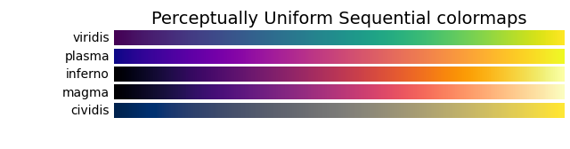
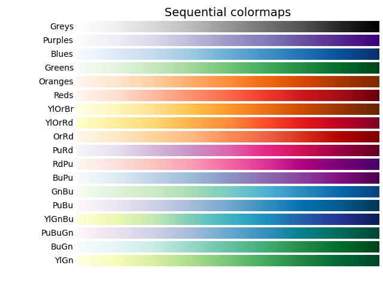
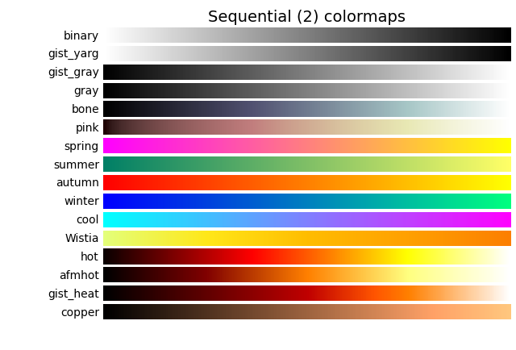
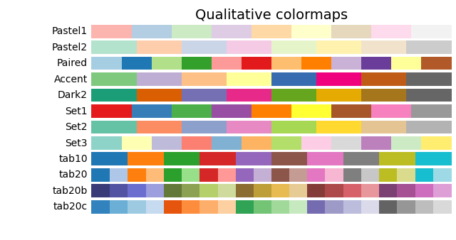
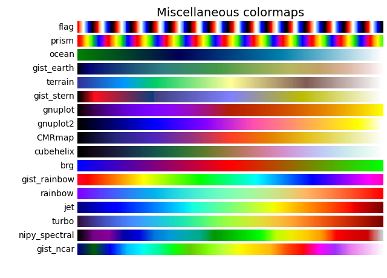
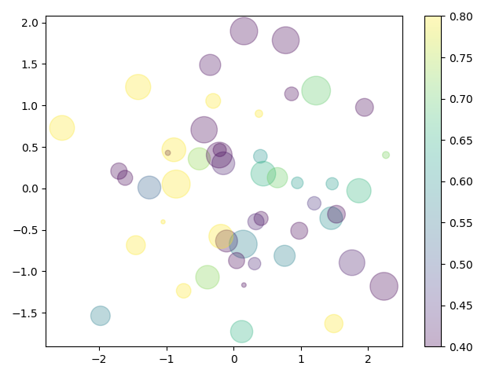

[**🇨🇳中文**](./README.md) | [**❓提问/Issues**](https://github.com/Winn1y/Show2Know/issues) | [**💬讨论/Discussions**](https://github.com/Winn1y/Show2Know/discussions/1)

<p align="center">
    <br>
    
    <br>
</p>

# <div align="center"><b><a>"目标成为可视化界的神仙水SK-II"</a></b></div>

<p align="center">
    
    
</p>


科研绘图是数据科学研究者的重要核心技能之一，好的绘图能够清晰明了的让文章易懂易读，甚至得到好的评审意见以及广泛的宣传引用。但由于目前在线网络教程资源存在**案例主题不明确**、**由于相关绘图库更新导致代码失效**、**使用外部数据集进行案例展示不便于迁移**、**教程说明质量参差不齐**等问题，对学术研究造成了一定的阻碍。


为了尽量缓解上述问题，达到**展示即理解**的程度，也即**Show to Know**（**Show2Know**，简称**SK-II**），本项目初步调研部分计算机领域的文献，整理开源出了目前深度学习领域常用的12种绘图类型，拟希望从**函数详细说明**、**多案例展示**、**配色建议**等角度，形成一定的高质量教学文档工具，进一步提高科研人的绘图技能，争做“**可视化界的神仙水**”，欢迎志同道合的同学一起参与贡献！

**本项目主要内容：**

- 🚀 针对计算机领域的44篇论文进行了初步整理，整合出12种基本绘图类型。 
- 🚀 开源了目前100%可运行代码，并保持不断更新多样化的案例。
- 🚀 拟希望详细描述不同绘图类型的不同绘制方法函数。
- 目前拟支持的绘图库：Matlablib、Pyechart

💡 欢迎志同道合的同学积极联系一同参与工具建设！

Tips：**我们希望坚持分享一个小知识来积累可视化技术的成长，由于平日有繁重学业压力，更新内容不会一次性更新太多，但积少成多，欢迎加入我们。近期面临秋招/申博，因此进度有些放缓，但会挤时间坚持，如果有合作意向可以邮件联系（WinniyGD@outlook.com）。**

## 新闻

**[2024/05/26] [v4.4版本](https://github.com/Winn1y/Show2Know/): 更新 水平波动线 知识点 (by Venchili)**

[2024/04/27] [v4.3版本](https://github.com/Winn1y/Show2Know/tree/4.3): 更新 实现论文中批量组合多个小图片脚本用于快速example展示[14 Multi-Image-To-One] 知识点 (by Winniy)**

[2024/03/29] [v4.2版本](https://github.com/Winn1y/Show2Know/tree/4.2): 更新 JoyPlot 重叠山峦图 知识点 (by Venchili)

[2024/02/23] [v4.1版本](https://github.com/Winn1y/Show2Know/tree/4.1): 更新 曲线图带文本及公式指向 知识点 (by Winniy)

[2024/01/29] [v4.0版本](https://github.com/Winn1y/Show2Know/tree/4.0): 更新 seaborn绘制热图 知识点 (by Venchili)

[2024/01/08] [v3.9版本](https://github.com/Winn1y/Show2Know/tree/3.9): 更新 拟合曲线 知识点 (by YasmineLIu)

[2023/12/22] [v3.8版本](https://github.com/Winn1y/Show2Know/tree/3.8): 更新 95%置信区间绘制图案例 知识点 (by Winniy)

[2023/12/08] [v3.7版本](https://github.com/Winn1y/Show2Know/tree/3.7): 更新 2D直方图细节 知识点 (by Venchili)

[2023/11/27] [v3.6版本](https://github.com/Winn1y/Show2Know/tree/3.6): 更新 桑基图函数说明 知识点 (by YasmineLIu)

[2023/11/10] [v3.5版本](https://github.com/Winn1y/Show2Know/tree/3.5): 更新 T-SNE绘制 知识点 (by Winniy)

[2023/10/29] [v3.4版本](https://github.com/Winn1y/Show2Know/tree/3.4): 更新 bar 柱状图丰富知识点 (by Venchili)

[2023/10/21] [v3.3版本](https://github.com/Winn1y/Show2Know/tree/3.3): 更新 axes 相关的知识点 (by Winniy)

[2023/10/01] [v3.2版本](https://github.com/Winn1y/Show2Know/tree/3.2): 更新 误差线绘制方法 知识点 (by Venchili)

[2023/09/18] [v3.1版本](https://github.com/Winn1y/Show2Know/tree/3.1): 更新 五数概括法及箱型法绘制 知识点 (by Winniy)

[2023/09/03] [v3.0版本](https://github.com/Winn1y/Show2Know/tree/3.0): 更新 Collection 中 polyCollection 和 RegularPolyCollection 功能说明 (by YasmineLIu)

[2023/08/20] [v2.9版本](https://github.com/Winn1y/Show2Know/tree/2.9): 更新 Choose Colormap 功能说明 (by Venchili)

[2023/08/06] [v2.8版本](https://github.com/Winn1y/Show2Know/tree/2.8): 更新 常用论文配色方案 (by Winniy)

[2023/07/23] [v2.7版本](https://github.com/Winn1y/Show2Know/tree/2.7): 更新 collection 函数说明 (by YasmineLIu)

[2023/07/09] [v2.6版本](https://github.com/Winn1y/Show2Know/tree/2.6): 更新 colormap 函数说明 (by Venchili)

[2023/06/24] [v2.5版本](https://github.com/Winn1y/Show2Know/tree/2.5): 更新scatter函数说明

[2023/06/04] [v2.4版本](https://github.com/Winn1y/Show2Know/tree/2.4): 新增带色表散点图演示笔记整理

[2023/06/02] [v2.3版本](https://github.com/Winn1y/Show2Know/tree/2.3):  新增Cmap笔记整理。

[2023/06/01] [v2.2版本](https://github.com/Winn1y/Show2Know/tree/2.2):  新增Marker点形状笔记整理。

[2023/05/25] [v2.1版本](https://github.com/Winn1y/Show2Know/tree/2.1):  Push基本版本，完善文档。

[2023/05/25] [v2.0版本](https://github.com/Winn1y/Show2Know/tree/2.0): 公开建立初始化Repo。

## Scatter散点图绘制方法

https://github.com/Winn1y/Show2Know/blob/main/1%20Scatter%20Plot/readme.md

## Marker整理

| Marker 点形状   |       可视化 |
|:-------:|:------:|
| ,        |  |
| .        |  |
| o        |  |
| v        |  |
| ^        |  |
| <        |  |
| \>        |  |
| 1        |  |
| 2        |  |
| 3        |  |
| 4        |  |
| 8        |  |
| s        |  |
| p        |  |
| P        |  |
| h        |  |
| H        |  |
| +        |  |
| x        |  |
| X        |  |
| D        |  |
| d        |  |
| &#124;        |  |
| _        |  |
| 0        |  |
| 1        |  |
| 2        |  |
| 3        |  |
| 4        |  |
| 5        |  |
| 6        |  |
| 7        |  |
| 8        |  |
| 9        |  |
| 10       |  |
| 11        |  |
| &#36; ... &#36;        |  |


## Cmap色表图









### 带色盘演示
```
import matplotlib.pyplot as plt
import numpy as np
from matplotlib import colors  # 注意！为了调整“色盘”，需要导入colors

rng = np.random.RandomState(0)
x = rng.randn(50)
y = rng.randn(50)
color = rng.rand(50)
sizes = 700 * rng.rand(50)

changecolor = colors.Normalize(vmin=0.4, vmax=0.8)

plt.scatter(x, y, c=color, s=sizes, alpha=0.3, cmap='viridis',norm=changecolor)

plt.colorbar()
plt.show()
```



## Todo

- [X] 完成散点图函数说明及案例分析
- [ ] 完成基本绘图类型的整体教程说明
- [ ] 更新真实论文案例展示


## 致谢

感谢参与开源贡献的同学们～！

<table>
  <tbody>
    <tr>
      <td align="center" valign="top" width="14.28%"><a href="https://github.com/Winn1y"><br /><sub><b>Winniy</b></sub></a><br /><a href="https://github.com/Winn1y" title="Code">💻</a> <a href="https://github.com/Winn1y" title="Design">🎨</a> <a href="https://github.com/Winn1y" title="Ideas, Planning, & Feedback">🤔</a></td>
      <td align="center" valign="top" width="14.28%"><a href="https://github.com/Venchili"><br /><sub><b>Venchili</b></sub></a><br /><a href="https://github.com/Venchili" title="Bug reports">🐛</a></td>
      <td align="center" valign="top" width="14.28%"><a href="https://github.com/YasmineLIu"><br /><sub><b>yaxin LIU</b></sub></a><br /><a href="https://github.com/YasmineLIu" title="Bug reports">🐛</a> <a href="https://github.com/YasmineLIu" title="Code">💻</a></td>
    </tr>
  </tbody>
</table>

